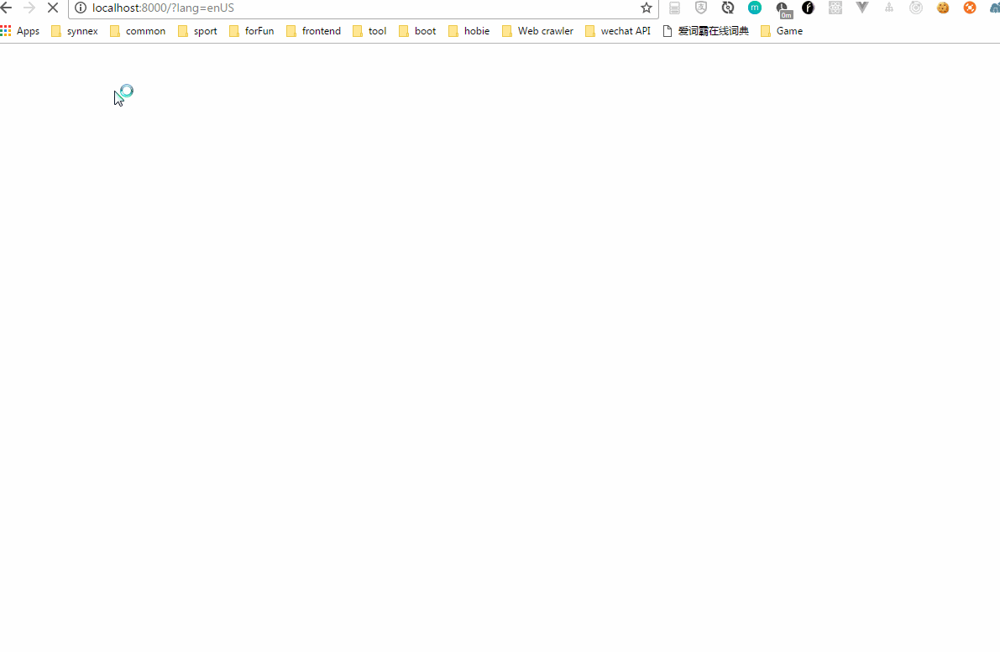

# 国际化（Internationalization）

> 这里的国际化主要是指前端的静态文字的多语言支持方案。 如果有需要了解具体的实现,参见相关的文件目录，包括src/lang/\*, src/utils/util.js, src/comonents/\*。

## 如何使用

### 在components中

~~~javascript
  import { LANG } from '../../lang/index';
  ...

  /* 根据语言类别，到对应的语言文件资源中，匹配‘APP.HyveHeader.Title’对应的文字，如果这个值还没有存在的话，使用第二个参数作为默认值。
  */
　
  const HYVEHEADER_TITLE = LANG('APP.HyveHeader.Title', 'RDT Test');

  ...

  

    {HYVEHEADER_TITLE}
  

  ...
~~~

### 编辑对应的语言资源

* src/lang/enUS.js
~~~javascript
export default {
  langEnUS: {
    'APP.Routes.NotFoundPage.NotFoundPageText': 'Not Found Page',
    'APP.HyveHeader.Title': 'Title',
  },
};
~~~
* src/lang/enUS.js
~~~javascript
export default {
  langEnUS: {
    'APP.Routes.NotFoundPage.NotFoundPageText': 'Not Found Page',
    'APP.HyveHeader.Title': 'Title',
  },
};
~~~

### 如何切换语言

> 基于目前的需求，这里采用了通过改变search parameter的方式来切换语言。这样的方案支持从外部传入当前页面的语言类别，同时也支持在当前页面切换语言。

> 下面是一个实例

* 如何在页面上代码切换语言

~~~js
  import { getLocParamObject, queryStringify } from '../../utils/util';
  ...
  const query = Object.assign(getLocParamObject(), { lang: value });
  window.location.href = window.location.pathname + queryStringify(query);
~~~

* 同样支持在url的search中直接更改语言参数

## 实现

> 相关代码参见src/lang/index.js

主要通过优先获取cookie中语言的类别的值；如果没有的话，从url的parameter中获取；如果仍然没有的话，使用默认的语言类别。

得到语言类别之后，在components中通过LANG(resourceKey, default)来获取对应的真正的值。
