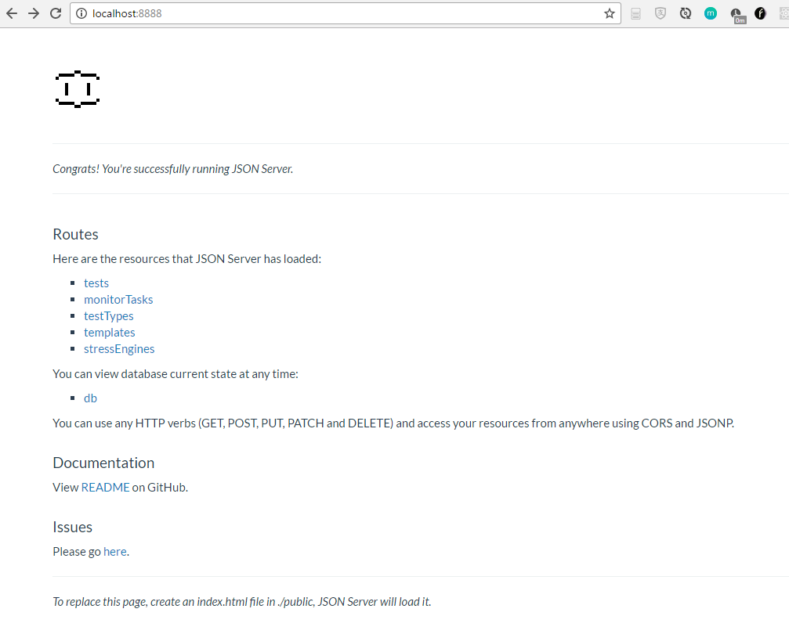

# 数据模拟

> 项目采用前后端分离的结构之后，前端工程与后端代码通过API接口联系起来。当接口被商定好了之后，两端程序员分别面向接口编程。而前端需要的接口数据，后台程序可能还没有真正的实现，所以就有必要使用模拟数据来支持我们的正常开发。

>与此相关的文件目录主要包括src/mockdata/\##, src/utils/Constant.js

## 如何使用

## 安装依赖(建议全局安装一次)
~~~batch
  npm install -g mockjs
  npm install -g json-server
~~~

## 编写模拟数据生成策略
> src/mockdata/dataGenerator.js

~~~js
...
{  
...
  'tests|2000': [{
    'sn': /(TWTHS|EBY)(02|01)[0-9]{8}/gi,
    'sku': /(HYV-N-TCH-4COMP-5|HYVSLEDP1G5A)/gi,
    'started': '@datetime(\'yyyy-MM-dd HH:mm:ss\')',
    'finished': '@datetime(\'yyyy-MM-dd HH:mm:ss\')',
    'option': {
      'name': /[a-z]{6,8}/gi
    }
  }]
...
}
...
~~~
>详细规则参见mockjs [文档](https://github.com/nuysoft/Mock/wiki) 和 [示例](http://mockjs.com/examples.html)

## 生成模拟数据资源 (只需要生成一次，除非数据有新的改动)

~~~batch
cd src/mockdata
node dataGenerator.js
~~~
或者直接点击src/mockdata/gen.bat (windows)

## 启动json-server
~~~batch
cd src/mockdata
json-server --watch db.json --port 8888
~~~
或者直接点击src/mockdata/mock.bat (windows)

## 测试是否启动正常

访问 [这里](http://localhost:8888) 查看是否模拟数据服务工作正常

如果你看到下面的页面，说明已经工作正常。

## 关于模拟数据服务

## 条件查询

* [所有tests中id=abc的所有记录]

  > GET http://localhost:8888/tests/abc

* [所有tests中option的name=abc的所有记录]

  > GET http://localhost:8888/tests?option.name=abc

* [所有tests中sn=abc的所有记录]

  > GET http://localhost:8888/tests?sn=abc

* [所有tests中sn=abc并且sku=abc的所有记录]

  > GET http://localhost:8888/tests?sn=abc&sku=abc

## 分页查询

* [所有tests中返回第2页的30条数据,更多的数据信息可以在header中拿到,比如数据的总条数是x-total-count]

  > GET http://localhost:8888/tests?_page=2&_limit=30

## 模糊查询

* [所有tests中sn包含abc的所有记录]

  > GET http://localhost:8888/tests?sn_like=abc

## 全文查询

* [所有tests中全文有包含abc的所有记录]

  > GET http://localhost:8888/tests?q=abc

## exclude查询（不包含指定字符的所有记录）

* [所有tests中sku不等于abc的所有记录]

  > GET http://localhost:8888/tests?sku_ne=abc

## 排序

* [结果根据abc的值降序排列]

  > GET http://localhost:8888/tests?_sort=abc&_order=DESC

更多的操作参见[这里](https://github.com/typicode/json-server)
